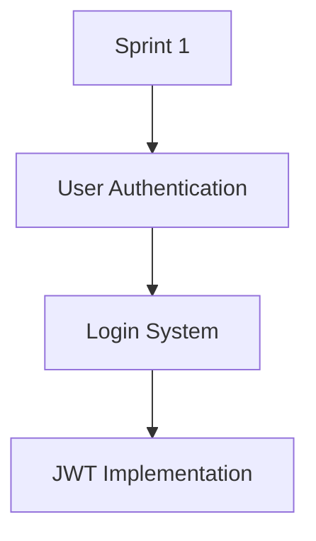

# roadmap-lane Usage Guide

This guide provides detailed usage examples and advanced features of the roadmap-lane CLI tool.

## Table of Contents

1. [Getting Started](#getting-started)
2. [Input File Format](#input-file-format)
3. [Command Reference](#command-reference)
4. [Output Formats](#output-formats)
5. [Advanced Features](#advanced-features)
6. [Best Practices](#best-practices)
7. [Troubleshooting](#troubleshooting)

## Getting Started

### Prerequisites

- Node.js 14.0.0 or higher
- npm or yarn package manager

### Installation

```bash
# Navigate to the project directory
cd pm-toolbox/projects/product-roadmap-cli

# Install dependencies
npm install

# Make the CLI available globally (optional)
npm link
```

### Your First Roadmap

Create a simple roadmap file `my-roadmap.yaml`:

```yaml
milestones:
  - name: "Sprint 1"
    outcomes:
      - name: "User Authentication"
        teams: ["Backend", "Frontend"]
        epics:
          - name: "Login System"
            team: "Backend"
            features:
              - "JWT Implementation"
              - "Session Management"
          - name: "Login UI"
            team: "Frontend"
            features:
              - "Login Form"
              - "Password Recovery"
```

Generate your first swimlane chart:

```bash
roadmap-lane plan my-roadmap.yaml
```

## Input File Format

### Complete Schema

```yaml
milestones:
  - name: string                    # Required: Milestone name
    description: string             # Optional: Milestone description
    startDate: string              # Optional: ISO date string
    endDate: string                # Optional: ISO date string
    status: string                 # Optional: planned, in-progress, completed
    outcomes:
      - name: string               # Required: Outcome name
        description: string        # Optional: Outcome description
        teams: string[]            # Optional: Array of team names
        priority: string           # Optional: high, medium, low
        status: string             # Optional: planned, in-progress, completed
        epics:
          - name: string           # Required: Epic name
            description: string    # Optional: Epic description
            team: string           # Optional: Owning team
            storyPoints: number    # Optional: Story point estimate
            priority: string       # Optional: high, medium, low
            status: string         # Optional: planned, in-progress, completed
            features:
              - name: string       # Feature as object
                description: string
                storyPoints: number
                priority: string
                status: string
                assignee: string
              - string             # Feature as simple string

dependencies:
  - from: string                   # Required: Source feature/epic name
    to: string                     # Required: Target feature/epic name
    type: string                   # Optional: blocks, enables, prerequisite

metadata:
  version: string                  # Optional: Roadmap version
  lastUpdated: string             # Optional: Last update date
  owner: string                   # Optional: Roadmap owner
  description: string             # Optional: Roadmap description
```

### JSON Format

The tool also accepts JSON format:

```json
{
  "milestones": [
    {
      "name": "Sprint 1",
      "outcomes": [
        {
          "name": "User Authentication",
          "teams": ["Backend", "Frontend"],
          "epics": [
            {
              "name": "Login System",
              "team": "Backend",
              "features": ["JWT Implementation", "Session Management"]
            }
          ]
        }
      ]
    }
  ]
}
```

## Command Reference

### `plan` Command

Generate swimlane visualizations from roadmap files.

```bash
roadmap-lane plan <file> [options]
```

**Arguments:**
- `<file>` - Path to roadmap YAML or JSON file

**Options:**
- `-v, --view <type>` - Output format: `table`, `mermaid`, `ascii`
- `-o, --output <file>` - Save output to file

**Examples:**

```bash
# Basic table view
roadmap-lane plan roadmap.yaml

# Generate Mermaid diagram
roadmap-lane plan roadmap.yaml --view=mermaid

# ASCII art visualization
roadmap-lane plan roadmap.yaml --view=ascii

# Save to file
roadmap-lane plan roadmap.yaml --view=mermaid --output=diagram.mmd
```

### `list` Command

Browse and filter roadmap contents.

```bash
roadmap-lane list [file] [options]
```

**Arguments:**
- `[file]` - Optional path to roadmap file (defaults to `./data/example-roadmap.yaml`)

**Options:**
- `-m, --milestone <name>` - Filter by milestone name (partial match)

**Examples:**

```bash
# List all milestones
roadmap-lane list

# List specific roadmap
roadmap-lane list my-roadmap.yaml

# Filter by milestone name
roadmap-lane list --milestone="Q1"
```

### `deps` Command

Visualize dependencies between features and epics.

```bash
roadmap-lane deps [file]
```

**Arguments:**
- `[file]` - Optional path to roadmap file

**Examples:**

```bash
# Show dependency tree
roadmap-lane deps

# Show dependencies for specific roadmap
roadmap-lane deps my-roadmap.yaml
```

### `export` Command

Export roadmap data for external tools.

```bash
roadmap-lane export [file] [options]
```

**Arguments:**
- `[file]` - Optional path to roadmap file

**Options:**
- `-f, --format <type>` - Export format: `json`, `csv`
- `-o, --output <file>` - Save to file

**Examples:**

```bash
# Export as JSON
roadmap-lane export --format=json

# Export as CSV
roadmap-lane export --format=csv

# Save to file
roadmap-lane export --format=csv --output=roadmap-export.csv
```

## Output Formats

### Table Format

The default table format provides a clean, structured view:

```
┌─────────────────────────────────────────────────────────────────┐
│                    Product Roadmap Swimlanes                   │
├───────────────┬────────────────────┬────────────────────┬───────┤
│   Milestone   │      Outcome       │        Epic        │ Team  │
├───────────────┼────────────────────┼────────────────────┼───────┤
│   Sprint 1    │ User Authentication│    Login System    │Backend│
├───────────────┼────────────────────┼────────────────────┼───────┤
│   Sprint 1    │ User Authentication│     Login UI       │Frontend│
└───────────────┴────────────────────┴────────────────────┴───────┘
```

### Mermaid Format

Generates Mermaid diagram syntax for flowcharts:



### ASCII Format

Terminal-friendly tree visualization:

```
┌─ Product Roadmap Swimlanes ─┐

├─ 📍 Sprint 1
│  ├─ 🎯 User Authentication
│  │   Teams: Backend, Frontend
│  │  ├─ 📚 Login System (Backend)
│  │  │  ├─ ⚡ JWT Implementation
│  │  │  └─ ⚡ Session Management
│  │  └─ 📚 Login UI (Frontend)
│  │     ├─ ⚡ Login Form
│  │     └─ ⚡ Password Recovery
└─────────────────────────────┘
```

## Advanced Features

### Dependency Management

Define relationships between features and epics:

```yaml
dependencies:
  - from: "JWT Implementation"
    to: "Session Management"
    type: "blocks"
  - from: "Login System"
    to: "Login Form"
    type: "enables"
```

**Dependency Types:**
- `blocks` - Source must complete before target can start
- `enables` - Source enables functionality in target
- `prerequisite` - Source is required for target

### Team Workload Analysis

The tool automatically analyzes team workload:

```bash
roadmap-lane export --format=json | jq '.metadata.teamWorkload'
```

### Story Point Tracking

Include story points for effort estimation:

```yaml
epics:
  - name: "Login System"
    storyPoints: 21
    features:
      - name: "JWT Implementation"
        storyPoints: 8
      - name: "Session Management"
        storyPoints: 5
```

## Best Practices

### Roadmap Structure

1. **Keep milestones focused** - Each milestone should have a clear theme
2. **Balance team workload** - Distribute work evenly across teams
3. **Define clear outcomes** - Each outcome should have measurable success criteria
4. **Use consistent naming** - Maintain naming conventions across epics and features

### Dependency Management

1. **Minimize dependencies** - Reduce coupling between features
2. **Document rationale** - Include descriptions for complex dependencies
3. **Review critical path** - Use `deps` command to identify bottlenecks

### Team Coordination

1. **Assign clear ownership** - Each epic should have a single owning team
2. **Cross-functional outcomes** - Outcomes can involve multiple teams
3. **Regular updates** - Keep roadmap current with actual progress

## Troubleshooting

### Common Issues

**File not found error:**
```bash
Error: File not found: roadmap.yaml
```
- Ensure file path is correct
- Use absolute paths if needed

**Invalid YAML syntax:**
```bash
Error parsing yaml: YAMLException: bad indentation
```
- Check YAML indentation (use spaces, not tabs)
- Validate YAML syntax with online validator

**Missing required fields:**
```bash
Milestone at index 0 must have a "name" property
```
- Ensure all milestones have names
- Check required fields in schema

### Debugging

Enable debug logging:

```bash
# Set environment variable for detailed logs
DEBUG=roadmap-lane roadmap-lane plan roadmap.yaml
```

### Performance

For large roadmaps:
- Use `--maxResults` option with grep searches
- Consider splitting into multiple milestone files
- Use CSV export for spreadsheet analysis

## Integration Examples

### Slack Integration

Export JSON and post to Slack:

```bash
roadmap-lane export --format=json | curl -X POST -H 'Content-type: application/json' --data @- YOUR_SLACK_WEBHOOK
```

### GitHub Actions

Automate roadmap validation:

```yaml
name: Validate Roadmap
on: [push]
jobs:
  validate:
    runs-on: ubuntu-latest
    steps:
      - uses: actions/checkout@v2
      - run: npm install
      - run: roadmap-lane plan roadmap.yaml
```

### Mermaid in Documentation

Include generated Mermaid in documentation:

```bash
roadmap-lane plan roadmap.yaml --view=mermaid --output=docs/roadmap.mmd
```

Then reference in Markdown:

```markdown
```mermaid
{{ include "docs/roadmap.mmd" }}
``` 
```
